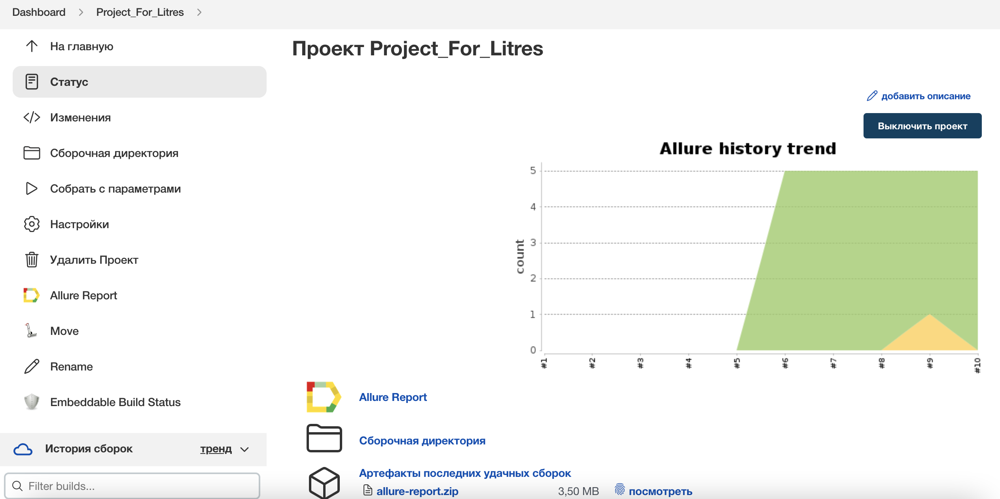
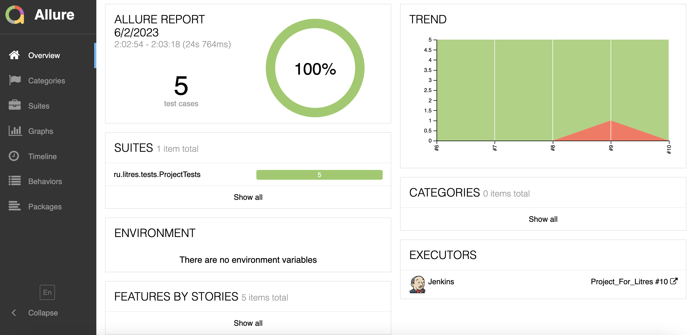
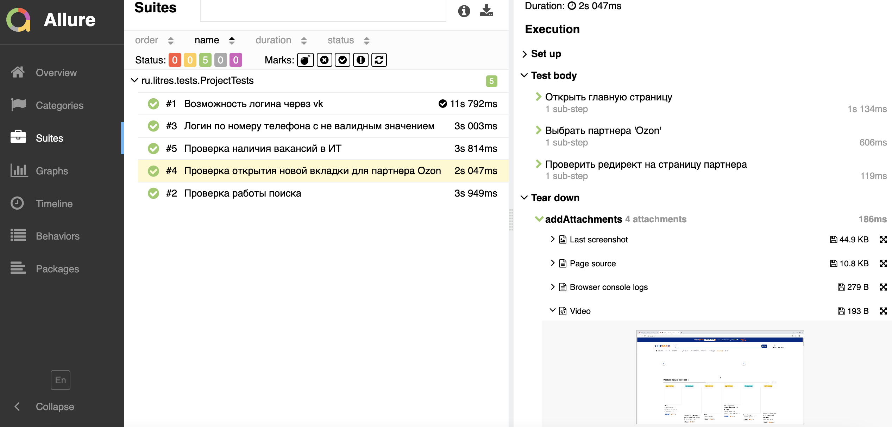
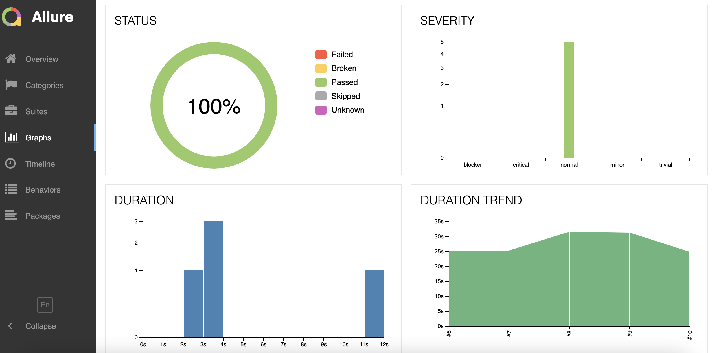
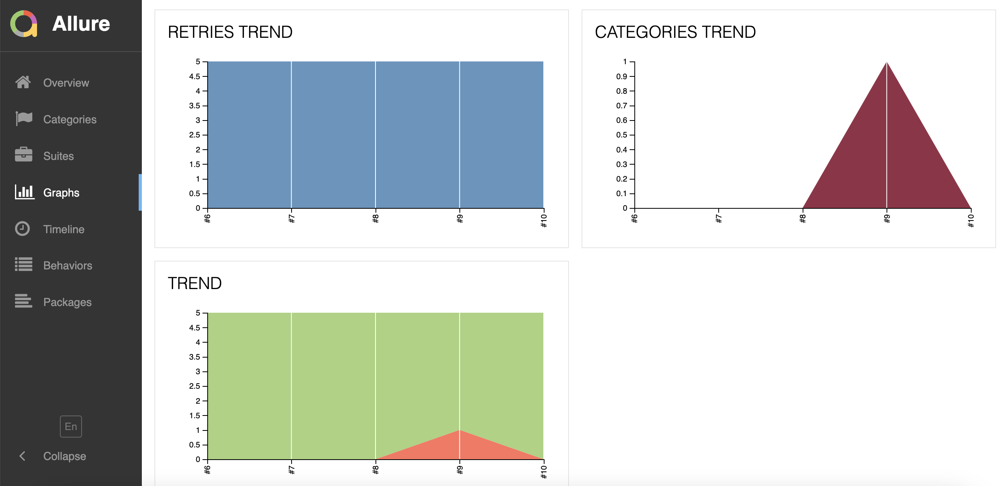
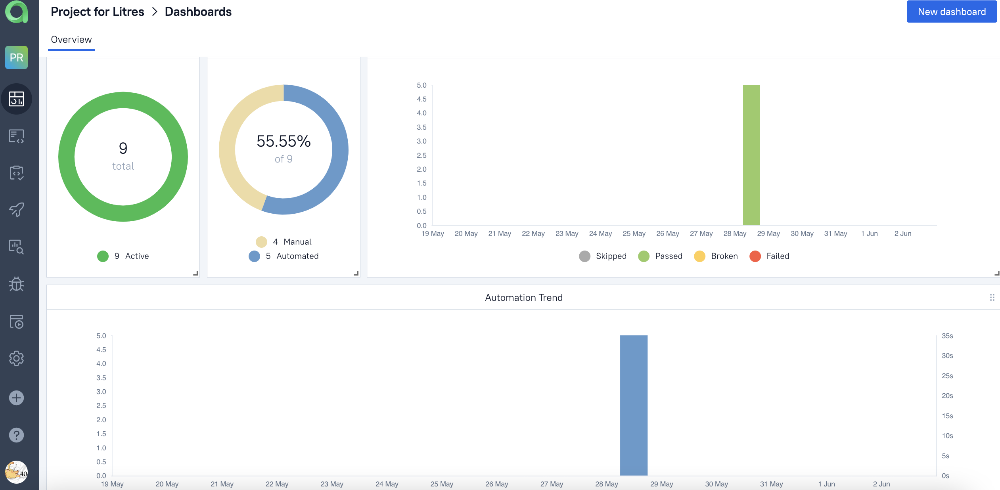
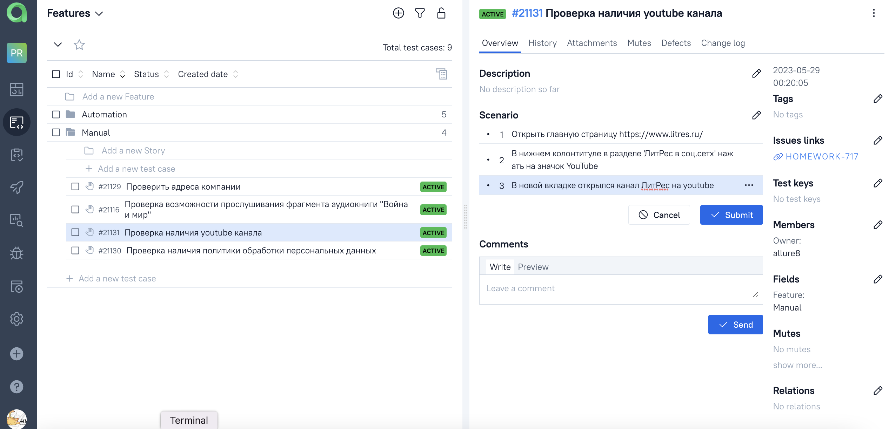
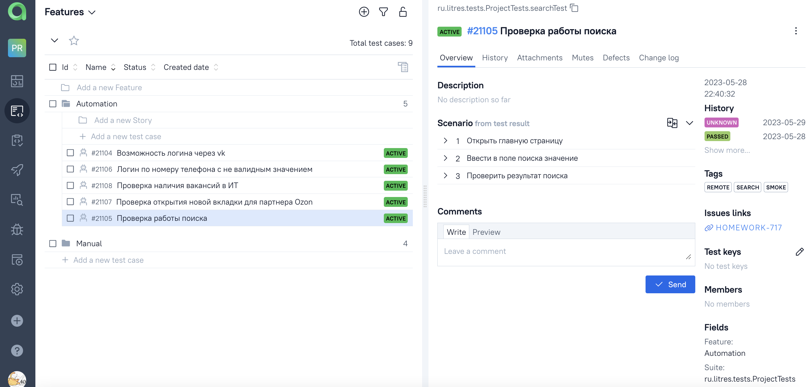
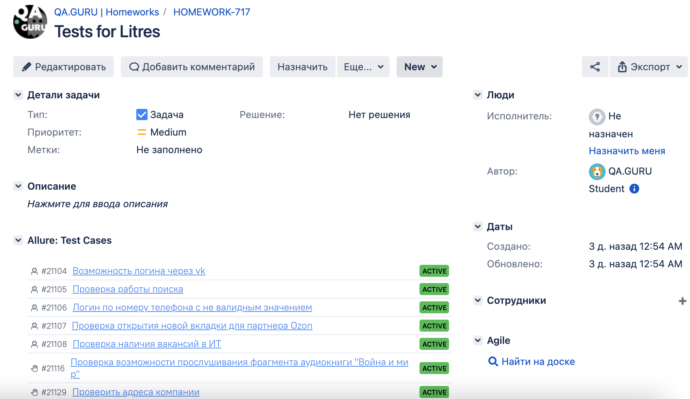
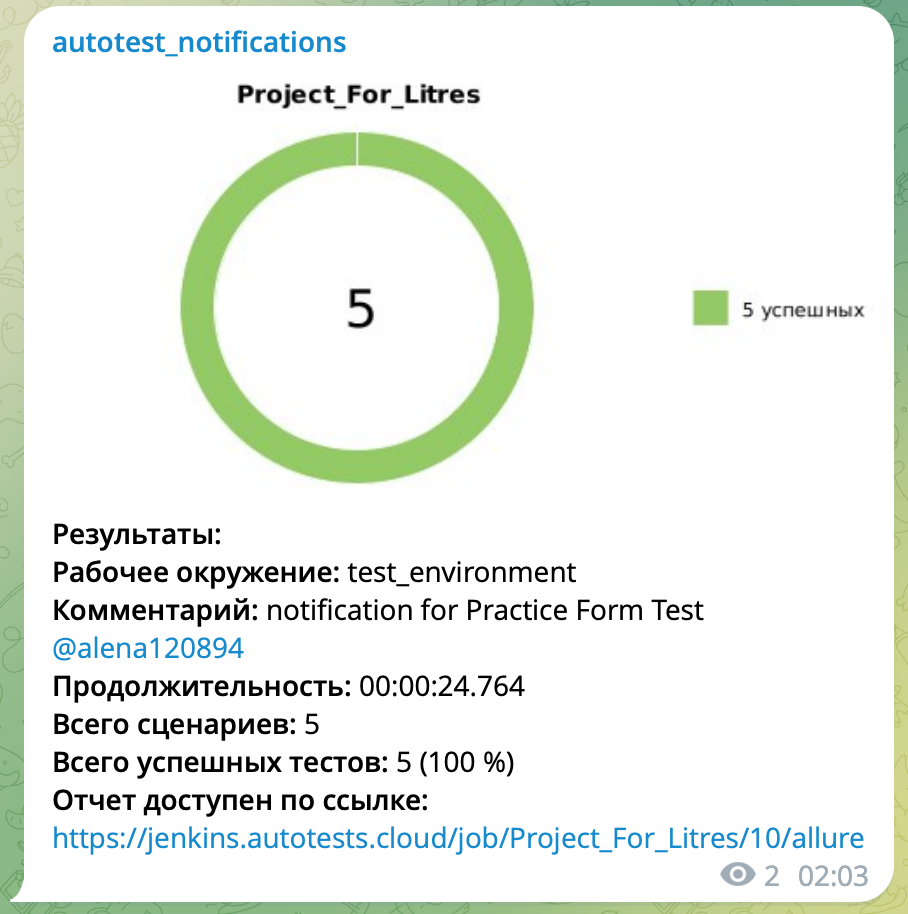

# Проект по автоматизации тестирования для компании [Litres](https://www.litres.ru/)

> Litres Сервис электронных книг №1 в России. Компания ЛитРес, основанная в 2005 году, сегодня является лидером на рынке лицензионных электронных книг в России и странах СНГ. Лауреат «Премии Рунета-2014».

## **Содержание:**

____
* Технологии и инструменты
* Примеры автоматизированных тест-кейсов
* Сборка в Jenkins
* Запуск из терминала
* Allure отчет
* Интеграция с Allure TestOps
* Интеграция с JIRA
* Уведомления в Telegram при помощи бота
* Примеры видео выполнения тестов на Selenoid
____

## <a name="Технологии и инструменты">**Технологии и инструменты:**</a>

<p align="center">  
<a href="https://www.jetbrains.com/idea/"></a>  
<a href="https://www.java.com/"></a>  
<a href="https://github.com/"></a>  
<a href="https://junit.org/junit5/"></a>  
<a href="https://gradle.org/"></a>  
<a href="https://selenide.org/"></a>  
<a href="https://aerokube.com/selenoid/"></a>  
<a href="ht[images](images)tps://github.com/allure-framework/allure2"></a> 
<a href="https://qameta.io/"></a>   
<a href="https://www.jenkins.io/"></a>  
<a href="https://www.atlassian.com/ru/software/jira/"></a>  
</p>

___
## <a name="Примеры автоматизированных тест-кейсов">**Примеры автоматизированных тест-кейсов:**</a>
___
* ✓ *Проверка работы поиска*
* ✓ *Возможность логина через vk*
* ✓ *Логин по номеру телефона с не валидным значением*
* ✓ *Проверка наличия вакансий в ИТ*
* ✓ *Проверка открытия новой вкладки для партнера Ozon*

___

## </a><a name="Сборка"></a>Сборка в [Jenkins](https://jenkins.autotests.cloud/job/Project_For_Litres/)</a>

___
<p align="center">
<a href="https://jenkins.autotests.cloud/job/Project_For_Litres/"></a>


## **Параметры сборки в Jenkins:**

***Удалённый запуск через Jenkins:***
```bash  
clean
${TASK}
-Dbase_url="${SITE_BASE_URL}"
-Dselenoid_url="${SELENOID_URL}"
-Dselenoid_login_password="${SELENOID_LOGIN}:${SELENOID_PASSWORD}"
-Dbrowser="${BROWSER}"
-Dbrowser_size="${BROWSER_SIZE}"
```
___
## </a> <a name="Allure"></a>Allure [отчет](https://jenkins.autotests.cloud/job/Project_For_Litres/allure/)</a>

___

### *Основная страница отчёта*

<p align="center">  
  
</p>  

### *Тест-кейсы*

<p align="center">  
  
</p>

### *Графики*

  <p align="center">  
  
  
</p>

___

## </a>Интеграция с <a target="_blank" href="https://allure.autotests.cloud/project/2427/dashboards">Allure TestOps</a>
___

### *Allure TestOps Dashboard*

<p align="center">
  
</p> 

### *Ручные тест-кейсы*

<p>="center">  
  
</p>

### *Авто тест-кейсы*

<p>="center">  
  
</p>

___

## </a> Интеграция с <a target="_blank" href="https://jira.autotests.cloud/browse/HOMEWORK-717">Jira</a>
____
<p align="center">  
  
</p>

____

## </a> Уведомление в Telegram при помощи бота
____
<p align="center">  
  
</p>

____
## </a> Примеры видео выполнения тестов на Selenoid
____
<p align="center">
   
</p>


